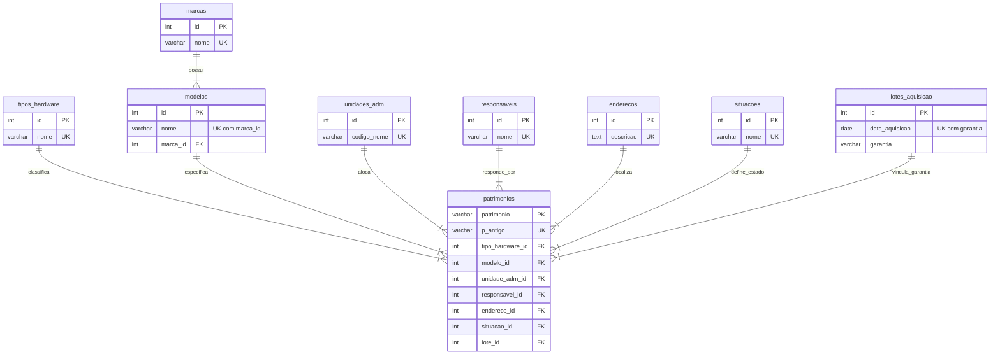

### 📊 2. Esquema Relacional do Banco de Dados (PostgreSQL)

O banco de dados está normalizado e numa boa estruturado, com tabelas de suporte para marcas, modelos, localizações e lotes, deixando a tabela principal (patrimonios) limpa e eficiente.

#### 2.1. Código Mermaid.js

Aqui está o código completo em Mermaid.js baseado exatamente no script SQL, constante no arquivo README.md do GitHub.
O diagrama abaixo ilustra a arquitetura normalizada do banco de dados. A tabela central `patrimonios` conecta-se a todas as tabelas especialistas através de chaves estrangeiras (`FK`).

🔍 O que esse diagrama explica:
1) Relacionamento de Modelos: Uma marca pode ter 1 ou muitos modelos, mas um modelo pertence obrigatoriamente a uma marca.
2) Centralização de Dados: A tabela patrimonios exige obrigatoriamente (||--|{) que cada item cadastrado aponte para um registro válido em cada uma das tabelas de suporte (não aceitando campos nulos, exatamente como os seus NOT REFERENCES ... NOT NULL do SQL).
3) Chaves Primárias Naturais: Mostra que o campo patrimonio (número patrimonial) é a própria Chave Primária (PK) de texto (character varying (50) ou varchar (50)), eliminando a necessidade de um ID sequencial numérico para essa tabela específica.
